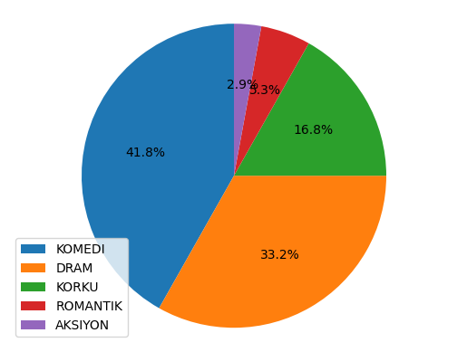
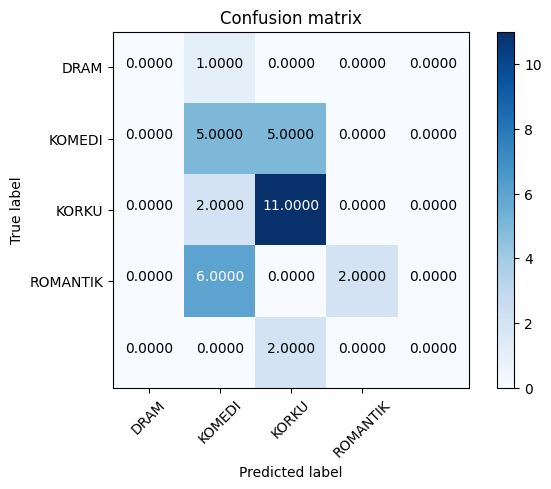
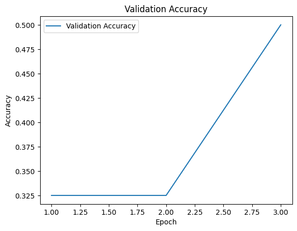

# Turkish-Movie-Classification-with-Neural-Networks

## Table of Contents

- [About the project](#about-the-project)
- [About the dataset](#about-the-dataset)
- [Collecting the Data](#collecting-the-data)
- [Usage](#usage)
- [How did I transcribe movies?](#how-did-i-transcribe-movies?)
- [How did I handle such a big text dataset?](#how-did-i-handle-such-a-big-text-dataset?)
- [Data Cleaning](#data-cleaning)
- [Model Training in Tensorflow](#model-training-in-tensorflow)
- [Scikit-Learn Models](#scikit-learn-models)
- [PreTrained HuggingFace BERT Model in PyTorch](#preTrained-huggingFace-bert-model-in-pyTorch)


## About the project:
The goal of the project is showing my Deep Learning skills and brighten my skills in Natural Language Processing. Turkish movies and serials are well-known worldwide, so I wanted to work on Turkish movies, also there are not many projects on Turkish language out here.

I collected, cleaned and processed the dataset in order to train big variety of models from most popular Machine Learning - Deep Learning libraries such as Tensorflow, Keras, PyTorch and Scikit-Learn. Also finetuned a pretrained model from HuggingFace. If you want to reach out to me, here is my [LinkedIn](www.linkedin.com/in/chanyalcin).

## About the dataset:
I self collected everything in this dataset, first I choosed the movie types I want to work on, then found 
movies on Youtube and collected them into 5 different playlists (because the library I used can only process 50 movies at once)

## Collecting the Data:
I used [googleapiclient](https://pypi.org/project/google-api-python-client/) library to access youtube v3 api
I got an api key from youtube

I extracted every video's url and title by using api

I used [pytube](https://pypi.org/project/pytube/) to download videos as .mp3 files,
* I modified 'yt\Lib\site-packages\pytube\streams.py' file's 311th line, I added
  `if not os.path.exists(file_path):` to handle the case where we do not have file_path exists*
* I modified `yt\Lib\site-packages\pytube\innertube.py` file's 223th line from `def __init__(self, client='ANDROID_MUSIC', use_oauth=False, allow_cache=True):` to `def __init__(self, client='ANDROID', use_oauth=False, allow_cache=True):`

[Original Code](https://stackoverflow.com/a/76780768/21653250)

## Usage
```bash
git clone https://github.com/g-hano/Turkish-Movie-Classification-with-Neural-Networks.git
cd Turkish-Movie-Classification-with-Neural-Networks
pip install -r requirements.txt
```

## How did I transcribe movies?

I used OpenAI's [Whisper](https://github.com/openai/whisper) to transribe videos one by one and saved into a pandas dataframe, "name","transcript" columns.

## How did I handle such a big text dataset?

I defined custom functions in function.py

```python
def remove_punctuation(text: str) -> str:
    """
    Simply removes any punctuation character from the gives text.
    """
    translator = str.maketrans('', '', string.punctuation)
    text = re.sub(r'[^\w\s]', '', text)
    return text.translate(translator)
```

```python
def contains_non_turkish(word: str) -> bool:
    """
    Checks if the character in the word is valid 'LATIN' or not.
    """
    for char in word:
        if 'LATIN' not in unicodedata.name(char, ''):
            return False
    return True
```

```python
def remove_words_without_non_turkish(text: str) -> str:
    """
    Removes the word if it contains any non-Turkish character.
    """
    words = text.split()
    words = [word for word in words if contains_non_turkish(word)]
    return ' '.join(words)
```

```python
def remove_words_without_non_turkish(text: str) -> str:
    """
    Removes the word if it contains any non-Turkish character.
    """
    words = text.split()
    words = [word for word in words if contains_non_turkish(word)]
    return ' '.join(words)
```
 
```python
def remove_substring(df: pd.DataFrame) -> pd.DataFrame:
    """
    OpenAI' Whisper is not perfect,
    some sentences appear in the transcript
    due to Whisper's fault or some films has intros/ads in it.
    """
    unwanted_text = ["some text","some other text]
    for unwanted in unwanted_text:
        df["transcript"] = df["transcript"].str.replace(f"{unwanted}", "", case=False)

    return df
```

```python
def remove_consecutive_duplicates(text:str ) -> str:
    """
    Removes the duplicates if it appears more than once.
    """
    words = text.split()
    cleaned_words = [words[i] for i in range(len(words)) if i == 0 or
			(words[i] != words[i-3]
			 and words[i] != words[i-2]
			 and words[i] != words[i-1])]
    return ' '.join(cleaned_words)
```

## Data Cleaning

I cleaned the dataset, dropped dirty rows, applied predefined functions on values.
checked if we have any Na values, plotted the pie chart of labels



Used Tensorflow's `Tokenizer`, `TurkishStemmer` and Spacy's `stopword` for Turkish. NOTE: I choosed spacy `tr_core_news_trf` package for better accuracy in tokenizing process.

Splitted dataset into train and test dataset.
Tokenized train data first,

```python
tokenized_sentences = []
for sentence in X_train: # in train split
   doc = nlp(sentence) # tokenize each row
   tokens = [token.lemma_ for token in doc if token.lemma_ not in stop_words] # stem each word if it is not a stop word
   stemmed_tokens = [stemmer.stem(token) for token in tokens]  # apply stemming to each token
   tokenized_sentences.append(" ".join(stemmed_tokens))
```


Used Tensorflow's `pad_sequences` in order to pad sequences into defined length, so each sequence have same length.

```python
sequences = tokenizer.texts_to_sequences(tokenized_sentences) # convert to numeric values
max_sequence_length = max(len(seq) for seq in sequences) # the longest sequence length
padded_sequences = pad_sequences(sequences, maxlen=max_sequence_length) # pad the sequences to ensure uniform length 
```

After that, I had to convert categorical attributes in target column, so that the model will be able to understand.Scikit-Learn's `LabelEncoder` class is used.

```python
le = LabelEncoder()
Y_train = le.fit_transform(Y_train) # convert to numeric

classes_mapping = dict(zip(le.classes_, le.transform(le.classes_)))
print("Class Mapping:", classes_mapping)
# Class Mapping: {'AKSIYON': 0, 'DRAM': 1, 'KOMEDI': 2, 'KORKU': 3, 'ROMANTIK': 4}
```

# Model Training in Tensorflow 

I created first models in Tensorflow, since it is easier to connect complex layers.
Most Models have same architecture in that part
```python
model = Sequential()
model.add(Embedding(input_dim=len(word_index) + 1, output_dim=100, input_length=X_train.shape[1]))
model.add(Bidirectional(LSTM(100, return_sequences=True)))
model.add(LSTM(100))
model.add(Dense(len(classes_mapping), activation='sigmoid'))
model.compile(optimizer='adam', loss='sparse_categorical_crossentropy', metrics=['accuracy'])

model.fit(X_train, Y_train, epochs=5, batch_size=8)
```

I have trained 4 models, each one has slight chances, here is the list:

**Architecture of Model 1:**
### 1. Embedding Layer:
   - We use Embedding because our Model will need to know which words are similar and which are not. Will be useful to determine the meanings of the words.

### 2. Bidirectional LSTM:
   - LSTM's are powerful in understanding context by processing input sequences, Bidirectional LSTM can process data in both forward and backward directions. It allows model to capture more data, both from the past and the future steps.
  
### 3. Dense Layer:
   - Takes what is returned from the last layer as input, returns the predicted output. Output units equal to the number of classes in the target.

### 4. Compilation:
   - **Optimizer:** Adam optimizer.
   - **Loss Function:** Sparse Categorical Crossentropy
   - **Evaluation Metric:** Accuracy
---

**Architecture of Model 2:**

**Adjusting for Overfitting:**
Since the first model overfit, I may need to reduce the power of the model and change some hyperparameters.

**Changes:**
- I reduced the number of Bidirectional LSTMs.
- Changed the output dimension of Embedding from 100 to 150.

**Results:**
- I ended up getting better results. %29 to 48, **+%65** improvement!
---

**Architecture of Model 3:**

## Same Model with Different Number of Output Dimension
*Last time it helped the model to learn better, so I will play with the output_dim.*
  
**Changes:**
- Changed the output dimension of Embedding from 150 to 200.

**Results:**
- I ended up getting way worse results. %48 to 31, **%35** degradation!

**Architecture of Model 4:**

**Changes:**
- I added a new Bidirectional LSTM.
- Changed the output dimension of Embedding from 200 to 256.

**Results:**
- I ended up getting better result than the last model. %31 to 40, **~%30** improvement!

---

Deep Neural Network models overfit, maybe I can try Scikit-Learn models. Let's give it a shot!

## Scikit-Learn Models

```python
from sklearn.linear_model import LogisticRegression
from sklearn.svm import SVC
from sklearn.tree import DecisionTreeClassifier
from sklearn.ensemble import RandomForestClassifier
from sklearn.neighbors import KNeighborsClassifier
```

<!DOCTYPE html>
<html>
<head>
  <style>
    table {
      font-family: Arial, sans-serif;
      border-collapse: collapse;
      width: 100%;
    }
    th, td {
      border: 1px solid #dddddd;
      text-align: left;
      padding: 8px;
    }
    th {
      background-color: #f2f2f2;
    }
  </style>
</head>
<body>

<h2>Classification Results</h2>

<table>
  <tr>
    <th>Name</th>
    <th>Accuracy</th>
    <th>F1 Score</th>
    <th>Recall</th>
  </tr>
  <tr>
    <td>Logistic Regression</td>
    <td>40%</td>
    <td>0.43</td>
    <td>0.6</td>
  </tr>
  <tr>
    <td>Support Vector Machine (SVM)</td>
    <td>52%</td>
    <td>0.34</td>
    <td>0.5</td>
  </tr>
  <tr>
    <td>Decision Tree</td>
    <td>50%</td>
    <td>0.36</td>
    <td>0.50</td>
  </tr>
  <tr>
    <td>Random Forest</td>
    <td>64%</td>
    <td>0.43</td>
    <td>0.5</td>
  </tr>
  <tr>
    <td>K-Nearest Neighbors</td>
    <td>21%</td>
    <td>0.32</td>
    <td>0.6</td>
  </tr>
</table>

</body>
</html>


Since number of 'AKSIYON' movies is very low compared to others, I will drop the rows which has 'AKSIYON' in their target column
This change will help our model to understand better and not to confuse.

do the exact preprocess steps,
after preprocessing and tokenizing the words, we can train our Random Forest model
we got 0.6 accuracy

```python
model = RandomForestClassifier(n_estimators=100, max_depth=20)
model.fit(X_train, Y_train)
predictions = model.predict(padded_sequences_test)
accuracy = accuracy_score(Y_test_encoded, predictions)# 0.60
```


As our next sklearn model, I will train a PassiveAggressiveClassifier, with tfidfVectorizer
first, we transform our sentences, then train the model.
```python
tfidf_v = TfidfVectorizer(max_features=5000, ngram_range=(1, 3))
tfidf_X = tfidf_v.fit_transform(tokenized_sentences).toarray()
tfidf_Y = Y_train
x_train, x_test, y_train, y_test = train_test_split(tfidf_X, tfidf_Y, test_size=0.2, random_state=0)
classifier = PassiveAggressiveClassifier(max_iter=1000)
classifier.fit(x_train, y_train)
```
we get this confusing matrix and accuracy




since our dataset is quite inbalanced, lets try to find a way to make it better.
In order to do that, I will use sklearn's 'compute_class_weight'

```python
from sklearn.utils.class_weight import compute_class_weight
from sklearn.model_selection import train_test_split
from sklearn.linear_model import LogisticRegression
from sklearn.metrics import accuracy_score, classification_report

class_weights = compute_class_weight('balanced', classes=np.unique(y_train), y=y_train)
class_weight_dict = dict(zip(np.unique(y_train), class_weights))

classifier = LogisticRegression(class_weight=class_weight_dict)
classifier.fit(x_train, y_train)

pred = classifier.predict(x_test)

accuracy = accuracy_score(y_test, pred)
report = classification_report(y_test, pred)

print("Accuracy:", accuracy)
print("Classification Report:\n", report)
```

## PreTrained HuggingFace BERT Model in PyTorch

lastly, I want to use "dbmdz/bert-base-turkish-128k-uncased" model from huggingface, in this case I will need PyTorch

This is the class architecture
```python
class MovieDataset(Dataset):
    """
    Our custom Dataset class inherited from torch.Dataset
    """
    def __init__(self, df, tokenizer, max_len):
        self.df = df
        self.tokenizer = tokenizer
        self.max_len = max_len
        self.labels = LabelEncoder().fit_transform(df["type"])  # handles categorical data in target column

    def __len__(self):
        return len(self.df)

    def __getitem__(self, index):
        transcript = str(self.df["transcript"].iloc[index])
        label = self.labels[index]

        input_dict = self.tokenizer(
            transcript,
            padding="max_length",
            truncation=True,
            max_length=self.max_len,
            return_tensors='pt'
        )

        return {
            'input_ids': input_dict['input_ids'].flatten(),
            'attention_mask': input_dict['attention_mask'].flatten(),
            'token_type_ids': input_dict['token_type_ids'].flatten(),
            'label': torch.tensor(label, dtype=torch.long)
        }
```
          
Hyperparameters
```python
# hyperparameters
MAX_LEN=40
TRAIN_BATCH_SIZE=8
VALID_BATCH_SIZE=8
EPOCHS=3
LR=5e-5
```
After training, we get this graph for our validation accuracy


Finally, we can save our model, optimizer and vocab
```python
# save the finetuned model
model_save_directory = "finetuned"
model.save_pretrained(model_save_directory)
tokenizer.save_pretrained(model_save_directory)

# Output:
#('finetuned\\tokenizer_config.json',
# 'finetuned\\special_tokens_map.json',
# 'finetuned\\vocab.txt',
# 'finetuned\\added_tokens.json')
```
